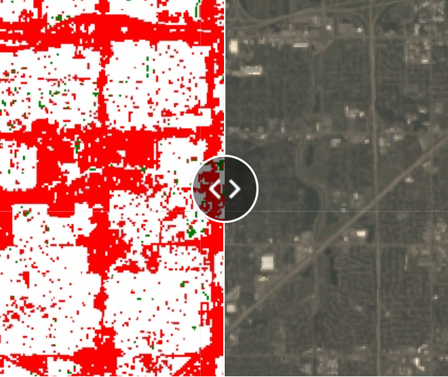

## Portfolio

---
### Automatic Line Drafting using the Hough Transformation

[Line Detection](/linedetect)

---
### Google Earth Engine - Split Land Cover
< a href="website name"></a>

---
### Alternative Fuel Facility Locations in Chicagoland
<!---->

---
### Transitshed Analysis for the Illinois 83 Widening

[Transitshed Analysis](/Transitshed)

---

Page template forked from <a href="https://github.com/evanca/quick-portfolio">evanca</a>

<!-- Remove above link if you don't want to attibute -->
